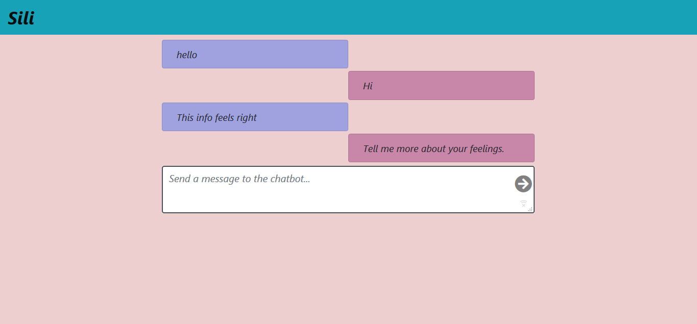

# django-chatbot

Implementing a simple chat system using chatterbot linked  with Django.The frontend using VueJS.

### Requirements
- ChatterBot==0.8.7
- chatterbot-corpus==1.1.2
- Django==2.1.1

Once you have it running type message into textbox and it will return a message.
